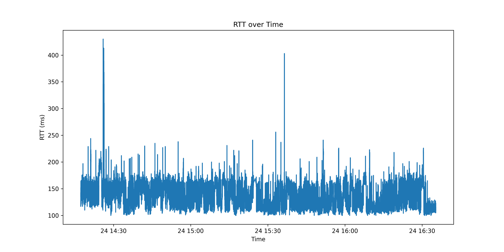
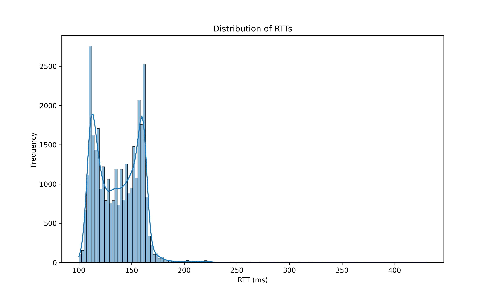
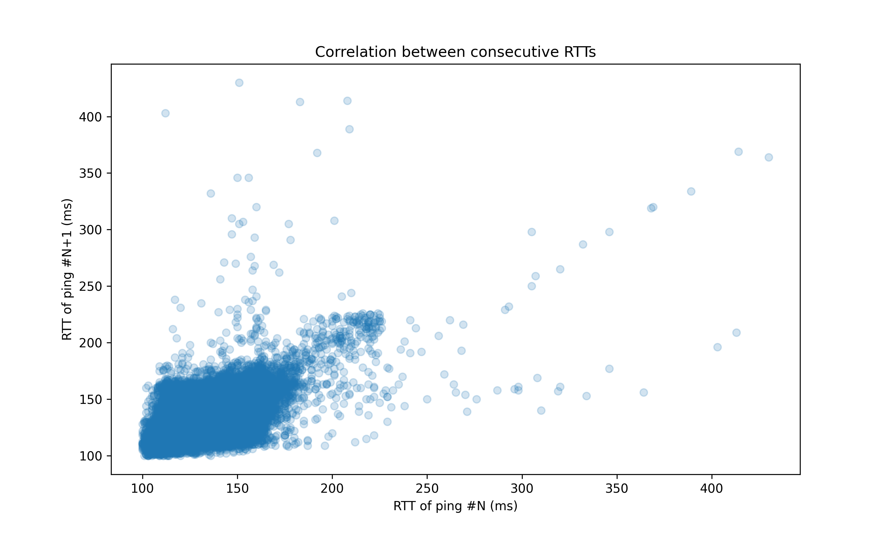

# Ping Analysis Report

## 1. Overall Delivery Rate
The overall delivery rate over the entire interval was 81.55%. This means that out of all echo requests sent, approximately 4 out of 5 received a reply. While this indicates a functional network path, there is a significant amount of packet loss that could impact application performance.

## 2. Longest Consecutive String of Successful Pings
The longest consecutive string of successful pings was 54, ranging from sequence numbers 35218 to 35271. This indicates that there were periods of stable connectivity, albeit relatively short ones. The network was able to maintain uninterrupted communication for this stretch, but it's not a particularly long run given the total number of pings sent.

## 3. Longest Burst of Losses
The longest burst of losses was 10, occurring between sequence numbers 2329 to 2390. This suggests that while there were instances of consecutive packet losses, they were generally not sustained for very long periods. However, a loss of 10 consecutive packets could cause noticeable disruptions in real-time applications.

## 4. Correlation of Packet Loss
- P(success | previous success) = 83.12%
- P(success | previous failure) = 74.62%
- Unconditional delivery rate: 81.55%

These figures show that packet losses have some degree of correlation, but it's not extremely strong. The probability of a successful ping after a previous success is only slightly higher than the unconditional rate, while the probability of success after a failure is somewhat lower. This suggests that network conditions have some short-term persistence, but losses are not strongly clustered.

## 5. Minimum RTT
The minimum RTT observed was 100 ms. This represents the best-case scenario for packet travel time and is likely close to the true MinRTT for this network path.

## 6. Maximum RTT
The maximum RTT observed was 430 ms. This shows that there can be significant variations in packet travel times, with some packets taking more than four times as long as the minimum RTT.

## 7. RTT over Time

The graph shows the RTT fluctuations over the 2-hour period. There are noticeable variations in RTT, with some periods of stability and others with more volatility. The presence of spikes indicates occasional periods of high latency.

## 8. Distribution of RTTs

The histogram reveals that the RTT distribution is bimodal (having two peaks). This symmetric double-peaked distribution suggests that the network path might be alternating between two distinct states or conditions. Each peak represents a common RTT value, with one peak at a lower RTT and another at a higher RTT. This bimodal distribution could be indicative of:

1. Two different network paths being used alternately.
2. The network switching between two distinct performance states.
3. Different levels of network congestion occurring regularly.

This bimodal nature of RTTs is an interesting finding that warrants further investigation to understand the underlying cause of these two distinct performance levels.

## 9. Correlation between Consecutive RTTs

The scatter plot shows a moderate positive correlation between consecutive RTTs. This suggests that if one ping has a high RTT, the next ping is also likely to have a higher RTT, indicating some temporal correlation in network conditions.

## 10. Conclusions

- The network path demonstrated moderate reliability with an overall delivery rate of 81.55%. While this indicates that the majority of packets were delivered successfully, there is a significant amount of packet loss that could impact application performance.

- Packet losses showed some degree of correlation, but not as strongly as might be expected. The probability of success given a previous success (83.12%) is only slightly higher than the unconditional delivery rate (81.55%), while the probability of success given a previous failure (74.62%) is lower but not dramatically so.

- The longest consecutive string of successful pings (54) and the longest burst of losses (10) provide insight into the network's stability. While there were periods of consistent performance, they were relatively short-lived.

- The RTT range from 100 ms to 430 ms indicates considerable variability in network latency. This wide range suggests that the network path experiences significant fluctuations in performance.

- The bimodal distribution of RTTs is a particularly interesting feature. It suggests that the network regularly alternates between two distinct performance states, which could be due to:
  - Two different network routes being used alternately.
  - Regular shifts in network load or configuration.
  - Periodic congestion or other recurring factors affecting latency.

- The moderate positive correlation between consecutive RTTs indicates that network conditions tend to persist for short periods, which could be useful for short-term performance prediction.

Overall, the network path shows moderate reliability but with notable performance inconsistencies. The delivery rate of 81.55% indicates room for improvement in terms of packet loss. The wide range of RTTs and the bimodal distribution suggest that the network regularly transitions between two performance states, which could impact application performance.

For applications using this network path:
1. They should be designed to handle frequent packet losses and retransmissions.
2. They should be prepared for significant variations in latency, including occasional high-latency periods.
3. Adaptive strategies that can detect and respond to the two different performance states (as indicated by the bimodal RTT distribution) might be beneficial.

Further investigation into the causes of the bimodal RTT distribution and the factors contributing to packet loss could provide valuable insights for improving network performance. This might involve analyzing network topology, identifying potential bottlenecks, and examining patterns in network usage or configuration changes.
